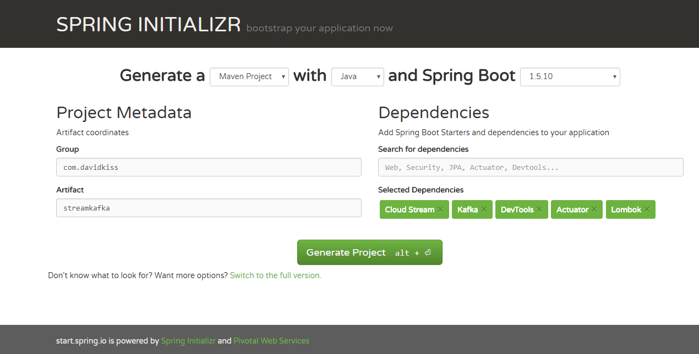

# Spring Cloud Stream with Kafka
by David Kiss (http://kaviddiss.com/2018/03/03/spring-cloud-stream-kafka/)

---

### Overview
This sample project demonstrates how to build [real-time streaming](https://aws.amazon.com/streaming-data/) applications using [event-driven architecture](https://thenewstack.io/event-driven-architecture-wave-future/),
 [Spring Boot](https://thenewstack.io/event-driven-architecture-wave-future/),
 [Spring Cloud Stream](https://cloud.spring.io/spring-cloud-stream/),
 [Apache Kafka](https://kafka.apache.org/) and
 [Lombok](https://projectlombok.org/).

+++

By end of this tutorial you'll have a simple Spring Boot based Greetings microservice running that
1. takes a message from a REST api
2. writes it to a Kafka topic
3. reads it from the topic
4. outputs it to the console

---

### Let's get started!

---

### What is Spring Cloud Streaming?
Spring Cloud Stream is a framework built upon Spring Boot for building message-driven microservices.

---

### What is Kafka?
Kafka is a popular high performant and horizontally scalable messaging platform originally developed by LinkedIn.

---

### Installing Kafka

+++

Download Kafka from [here](https://kafka.apache.org/downloads) and untar it:
```
> tar -xzf kafka_2.11-1.0.0.tgz
> cd kafka_2.11-1.0.0
```

+++

Start Zookeeper and Kafka

On Windows:
```
> bin\windows\zookeeper-server-start.bat config\zookeeper.properties
> bin\windows\kafka-server-start.bat config\server.properties
```

On Linux or Mac:
```
> bin/zookeeper-server-start.sh config/zookeeper.properties
> bin/kafka-server-start.sh config/server.properties
```

+++

If Kafka is not running and fails to start after your computer wakes up from hibernation, delete the ```<TMP_DIR>/kafka-logs``` folder and then start Kafka again.

---

### What is Lombok?
Lombok is a java framework that automatically generates getters, setters, toString(), builders, loggers, etc. in the code.

---

### Maven dependencies

+++

Go to https://start.spring.io to create a maven project:


+++

1. Add necessary dependencies: ```Spring Cloud Stream```, ```Kafka```, ```Devtools``` (for hot redeploys during development, optional), ```Actuator``` (for monitoring application, optional), ```Lombok``` (make sure to also have the Lombok plugin installed in your IDE)
2. Click the Generate Project button to download the project as a zip file
3. Extract zip file and import the maven project to your favourite IDE

+++

Notice the maven dependencies in the ```pom.xml``` file:
```
  <dependency>
      <groupId>org.springframework.boot</groupId>
      <artifactId>spring-boot-starter-actuator</artifactId>
  </dependency>
  <dependency>
      <groupId>org.springframework.cloud</groupId>
      <artifactId>spring-cloud-stream</artifactId>
  </dependency>
  <dependency>
      <groupId>org.springframework.cloud</groupId>
      <artifactId>spring-cloud-starter-stream-kafka</artifactId>
  </dependency>
```

+++

```
  <!-- Also install the Lombok plugin in your IDE -->
  <dependency>
      <groupId>org.projectlombok</groupId>
      <artifactId>lombok</artifactId>
      <optional>true</optional>
  </dependency>

  <!-- hot reload - press Ctrl+F9 in IntelliJ after a code change while application is running -->
  <dependency>
      <groupId>org.springframework.boot</groupId>
      <artifactId>spring-boot-devtools</artifactId>
      <optional>true</optional>
  </dependency>
```

+++

... also the ```<dependencyManagement>``` section:
```
    <dependencyManagement>
        <dependencies>
            <dependency>
                <!-- Import dependency management from Spring Boot -->
                <groupId>org.springframework.boot</groupId>
                <artifactId>spring-boot-dependencies</artifactId>
                <version>${spring-boot.version}</version>
                <type>pom</type>
                <scope>import</scope>
            </dependency>
...
```

+++

```
...
            <dependency>
                <groupId>org.springframework.cloud</groupId>
                <artifactId>spring-cloud-stream-dependencies</artifactId>
                <version>${spring-cloud-stream.version}</version>
                <type>pom</type>
                <scope>import</scope>
            </dependency>
        </dependencies>
    </dependencyManagement>
```

+++

... and the ```<repository>``` section:
```
    <repository>
        <id>spring-milestones</id>
        <name>Spring Milestones</name>
        <url>http://repo.spring.io/libs-milestone</url>
        <snapshots>
            <enabled>false</enabled>
        </snapshots>
    </repository>
```

---

### Define the Kafka streams
```
package com.kaviddiss.streamkafka.stream;

import org.springframework.cloud.stream.annotation.Input;
import org.springframework.cloud.stream.annotation.Output;
import org.springframework.messaging.MessageChannel;
import org.springframework.messaging.SubscribableChannel;
```

+++

```
public interface GreetingsStreams {
    String INPUT = "greetings-in";
    String OUTPUT = "greetings-out";

    @Input(INPUT)
    SubscribableChannel inboundGreetings();

    @Output(OUTPUT)
    MessageChannel outboundGreetings();
}
```

+++

In order for our application to be able to communicate with Kafka, we'll need to define an outbound stream to write messages to a Kafka topic, and an inbound stream to read messages from a Kafka topic.

+++

Spring Cloud provides a convenient way to do this by simply creating an interface that defines a separate method for each stream.

+++

The ```inboundGreetings()``` method defines the inbound stream to read from Kafka and ```outboundGreetings()``` method defines the outbound stream to write to Kafka.

+++

During runtime Spring will create a java proxy based implementation of the ```GreetingsStreams``` interface that can be injected as a Spring Bean anywhere in the code to access our two streams. 

---

### Configure Spring Cloud Stream
Our next step is to configure Spring Cloud Stream to bind to our streams in the ```GreetingsStreams``` interface. 

+++

This can be done by creating a ```@Configuration``` class ```com.kaviddiss.streamkafka.config.StreamsConfig``` with below code:

+++

```
package com.kaviddiss.streamkafka.config;

import com.kaviddiss.streamkafka.stream.GreetingsStreams;
import org.springframework.cloud.stream.annotation.EnableBinding;

@EnableBinding(GreetingsStreams.class)
public class StreamsConfig {
}
```

+++

Binding the streams is done using the ```@EnableBinding``` annotation where the ```GreatingsService``` interface is passed to.

---

### Configuration properties for Kafka

By default, the configuration properties are stored in the ```src/main/resources/application.properties``` file.

+++

However I prefer to use the YAML format as it's less verbose and allows to keep both common and environment-specific properties in the same file.

+++

For now, let's rename ```application.properties``` to ```application.yaml``` and paste below config snippet into the file:

+++

```
spring:
  cloud:
    stream:
      kafka:
        binder:
          brokers: localhost:9092
      bindings:
        greetings-in:
          destination: greetings
          contentType: application/json
        greetings-out:
          destination: greetings
          contentType: application/json
```          

+++

The above configuration properties configure the address of the Kafka server to connect to, and the Kafka topic we use for both the inbound and outbound streams in our code. They both must use the same Kafka topic!

+++

The ```contentType``` properties tell Spring Cloud Stream to send/receive our message objects as ```String```s in the streams.

---

### Create the message object

Create a simple ```com.kaviddiss.streamkafka.model.Greetings``` class with below code that will represent the message object we read from and write to the ```greetings``` Kafka topic:

+++

```
package com.kaviddiss.streamkafka.model;

// lombok autogenerates getters, setters, toString() and a builder (see https://projectlombok.org/):
import lombok.Builder;
import lombok.Getter;
import lombok.Setter;
import lombok.ToString;

@Getter @Setter @ToString @Builder
public class Greetings {
    private long timestamp;
    private String message;
}
```

+++

Notice how the class doesn't have any getters and setters thanks to the Lombok annotations. The ```@ToString``` will generate a ```toString()``` method using the class' fields and the ```@Builder``` annotation will allow us creating ```Greetings``` objects using fluent builder (see below).

---

### Create service layer to write to Kafka

Let's create the ```com.kaviddiss.streamkafka.service.GreetingsService``` class with below code that will write a ```Greetings``` object to the ```greetings``` Kafka topic:

+++

```
package com.kaviddiss.streamkafka.service;

import com.kaviddiss.streamkafka.model.Greetings;
import com.kaviddiss.streamkafka.stream.GreetingsStreams;
import lombok.extern.slf4j.Slf4j;
import org.springframework.messaging.MessageChannel;
import org.springframework.messaging.MessageHeaders;
import org.springframework.messaging.support.MessageBuilder;
import org.springframework.stereotype.Service;
import org.springframework.util.MimeTypeUtils;
```

+++

```
@Service
@Slf4j
public class GreetingsService {
    private final GreetingsStreams greetingsStreams;

    public GreetingsService(GreetingsStreams greetingsStreams) {
        this.greetingsStreams = greetingsStreams;
    }
```

+++

```
    public void sendGreeting(final Greetings greetings) {
        log.info("Sending greetings {}", greetings);

        MessageChannel messageChannel = greetingsStreams.outboundGreetings();
        messageChannel.send(MessageBuilder
                .withPayload(greetings)
                .setHeader(MessageHeaders.CONTENT_TYPE, MimeTypeUtils.APPLICATION_JSON)
                .build());
    }
}
```

+++

The ```@Service``` annotation will configure this class as a Spring Bean and inject the ```GreetingsService``` dependency via the constructor.

+++

The ```@Slf4j``` annotation will generate an SLF4J logger field that we can use for logging.

+++

In the ```sendGreeting()``` method we use the injected ```GreetingsStream``` object to send a message represented by the ```Greetings``` object.

---

### Create REST api

Now we'll be creating a REST api endpoint that will trigger sending a message to Kafka using the ```GreetingsService``` Spring Bean:

+++

```
package com.kaviddiss.streamkafka.web;

import com.kaviddiss.streamkafka.model.Greetings;
import com.kaviddiss.streamkafka.service.GreetingsService;
import org.springframework.http.HttpStatus;
import org.springframework.web.bind.annotation.GetMapping;
import org.springframework.web.bind.annotation.RequestParam;
import org.springframework.web.bind.annotation.ResponseStatus;
import org.springframework.web.bind.annotation.RestController;
```

+++

```
@RestController
public class GreetingsController {
    private final GreetingsService greetingsService;

    public GreetingsController(GreetingsService greetingsService) {
        this.greetingsService = greetingsService;
    }
```

+++

```
    @GetMapping("/greetings")
    @ResponseStatus(HttpStatus.ACCEPTED)
    public void greetings(@RequestParam("message") String message) {
        Greetings greetings = Greetings.builder()
            .message(message)
            .timestamp(System.currentTimeMillis())
            .build();

        greetingsService.sendGreeting(greetings);
    }
}
```

+++

The ```@RestController``` annotation tells Spring that this is a Controller bean (the C from MVC). The ```greetings()``` method defines an ```HTTP GET /greetings``` endpoint that takes a ```message``` request param and passes it to the ```sendGreeting()``` method in ```GreetingsService```.

---

### Listening on the greetings Kafka topic

Let's create a ```com.kaviddiss.streamkafka.service.GreetingsListener``` class that will listen to messages on the ```greetings``` Kafka topic and log them on the console:

+++

```
package com.kaviddiss.streamkafka.service;

import com.kaviddiss.streamkafka.model.Greetings;
import com.kaviddiss.streamkafka.stream.GreetingsStreams;
import lombok.extern.slf4j.Slf4j;
import org.springframework.cloud.stream.annotation.StreamListener;
import org.springframework.messaging.handler.annotation.Payload;
import org.springframework.stereotype.Component;
```

+++

```
@Component
@Slf4j
public class GreetingsListener {
    @StreamListener(GreetingsStreams.INPUT)
    public void handleGreetings(@Payload Greetings greetings) {
        log.info("Received greetings: {}", greetings);
    }
}
```

+++

The ```@Component``` annotation similarly to ```@Service``` and ```@RestController``` defines a Spring Bean.

+++

```GreetingsListener``` has a single method, ```handleGreetings()``` that will be invoked by Spring Cloud Stream with every new ```Greetings``` message object on the ```greetings``` Kafka topic. This is thanks to the ```@StreamListener``` annotation configured for the ```handleGreetings()``` method.

---

### Running the application
The last piece of the puzzle is the ```com.kaviddiss.streamkafka.StreamKafkaApplication``` class that was auto-generated by the Spring Initializer:

+++

```
package com.kaviddiss.streamkafka;

import org.springframework.boot.SpringApplication;
import org.springframework.boot.autoconfigure.SpringBootApplication;

@SpringBootApplication
public class StreamKafkaApplication {

    public static void main(String[] args) {
        SpringApplication.run(StreamKafkaApplication.class, args);
    }
}
```

+++

No need to make any changes here. You can either run this class as a Java application from your IDE, or run the application from the command line using the Spring Boot maven plugin:

```
> mvn spring-boot:run
```

+++

Once the application is running, go to http://localhost:8080/greetings?message=hello in the browser and check your console.

---

### Summary
I hope you enjoyed this tutorial. Feel free to ask any questions and leave your feedback.
